# social_mate

Social Mate is a cross‑platform social‑networking Flutter app built with Supabase backend services. Users can **authenticate (email/password or Google)**, go through an **onboarding tour**, create posts, follow people, browse a discovery feed, chat in real‑time, view and add stories, manage their profile, and receive push notifications. The UI adapts to **Arabic/English** and supports **light & dark themes** with persisted preferences.

---

## 📱 Project Overview

Social Mate is a cross‑platform social‑networking Flutter app built with Supabase backend services.  
Users can **authenticate (email/password or Google)**, go through an **onboarding tour**, create posts, follow people, browse a discovery feed, chat in real‑time, view and add stories, manage their profile, and receive push notifications.  
The UI adapts to **Arabic/English** and supports **light & dark themes** with persisted preferences.

---

## ✨ Features

- **Authentication**
  - Email/password sign‑up & sign‑in
  - Google sign‑in
  - Auth state management with `AuthCubit`
- **Onboarding flow**
  - Four‑page introduction shown the first time
  - State persisted via `OnboardingCubit`
- **Localization**
  - Full Arabic and English support
  - Strings defined in `intl_en.arb` / `intl_ar.arb`
  - Language selection via `LocalizationCubit`
- **Theme switching**
  - Light / dark / system themes
  - `ThemeCubit` + `HydratedCubit` for persistence
- **Core social features**
  - Feed discovery
  - Creating & editing posts (text, images, videos)
  - Stories
  - Follow/followers, follow requests
  - Profile (public/private), edit profile, saved posts
  - Real‑time chats with Supabase
  - Notifications (push via Supabase function)
- **Additional utilities**
  - Internet connectivity status
  - File picking & native sharing
  - Supabase storage & database services
  - Native splash screens
  - Google sign‑in integration
  - DOTENV support for secrets

---

## 🛠️ Technologies Used

- **Flutter SDK**: environment `sdk: ^3.9.2` (see `pubspec.yaml`)
- **State management**: `flutter_bloc`/`hydrated_bloc` (Cubit pattern)
- **Routing**: custom `AppRouter` with named routes
- **Localization**: `flutter_localization` + Intl (`flutter_intl`)
- **Theme management**: `ThemeCubit` with `ThemeMode` states
- **Other dependencies** (from `pubspec.yaml`):
  `auto_size_text`, `cached_network_image`, `connectivity_plus`, `dio`, `file_picker`, `firebase_core/messaging`, `flutter_dotenv`, `flutter_screenutil`, `flutter_svg`, `get`, `google_sign_in`, `hydrated_bloc`, `image_picker`, `intl`, `loading_animation_widget`, `open_filex`, `path_provider`, `persistent_bottom_nav_bar_v2`, `shared_preferences`, `skeletonizer`, `supabase_flutter`, `timeago`, `video_player`, `visibility_detector`, …and more.
- **Architecture**: feature‑based clean architecture –  
  `core/` for shared utilities, `features/` split into sub‑modules such as `auth`, `chat`, `discover`, `home`, `profile`, etc.

---

## 📸 Screenshots

### 🌐 Arabic Localization

| Screenshot                                                            | Description                |
| --------------------------------------------------------------------- | -------------------------- |
| 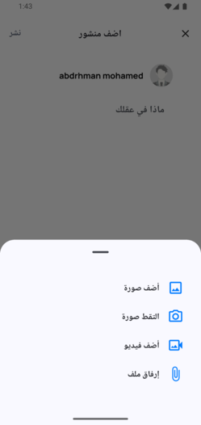 | Add Post (Arabic)          |
| 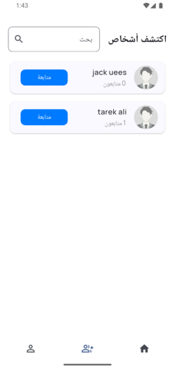 | Discover feed (Arabic)     |
| 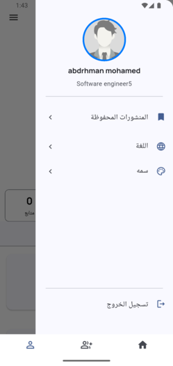     | Navigation drawer (Arabic) |
| 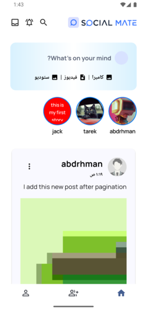         | Home screen (Arabic)       |
| 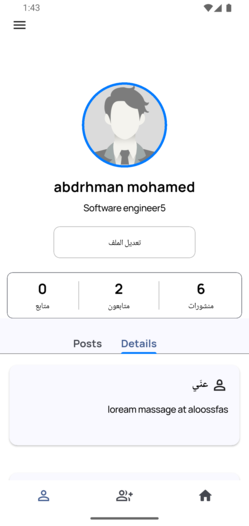   | Profile screen (Arabic)    |

### ☀️ Light Mode

| Screenshot                                                                                                                                                                                                                                            | Page                           |
| ----------------------------------------------------------------------------------------------------------------------------------------------------------------------------------------------------------------------------------------------------- | ------------------------------ |
| 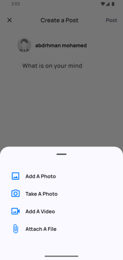 / 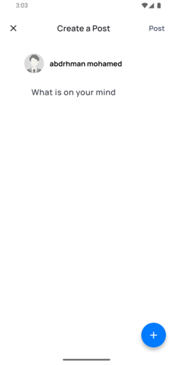                                                                                                                   | Add post pages                 |
| 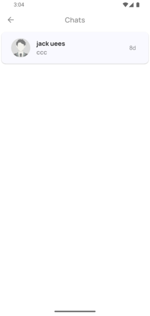 / 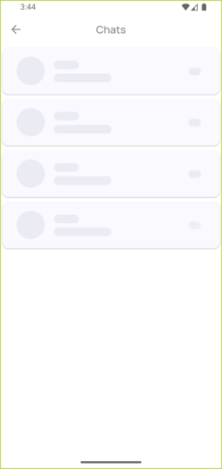                                                                                                                       | Chats list & loading           |
| 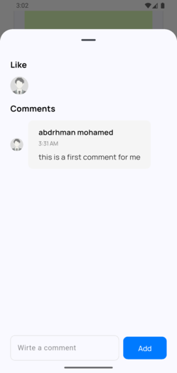                                                                                                                                                                                          | Comments view                  |
| 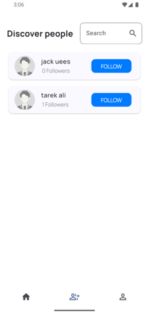                                                                                                                                                                                          | Discover feed                  |
| 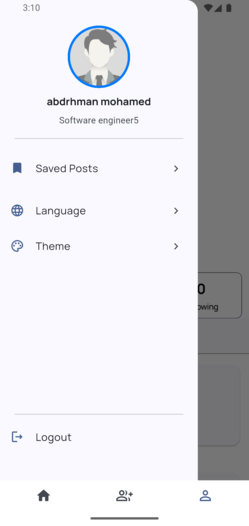                                                                                                                                                                                              | Drawer                         |
| 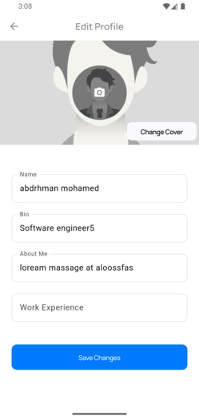                                                                                                                                                                                  | Edit profile                   |
| 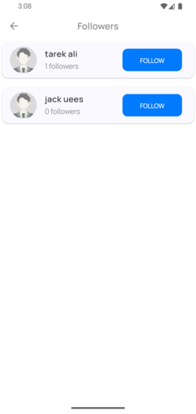                                                                                                                                                                                        | Followers list                 |
| 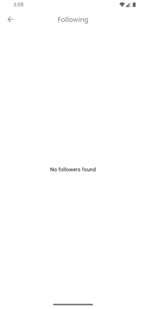                                                                                                                                                                                        | Following list                 |
| 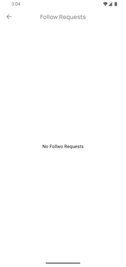                                                                                                                                                                            | Follow requests                |
| 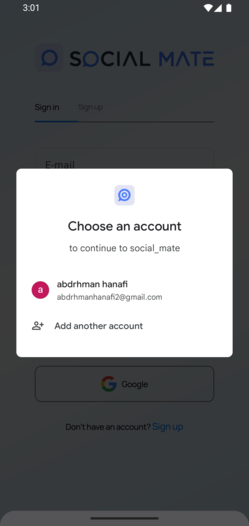                                                                                                                                                                                 | Google sign‑in screen          |
| 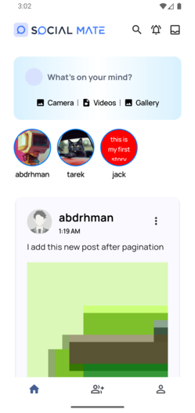 / 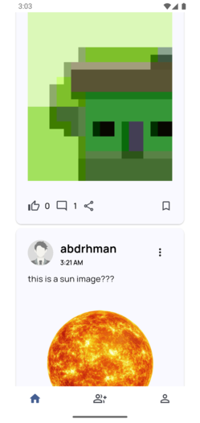 / 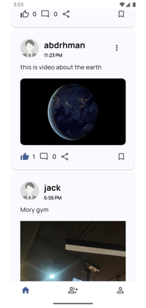 / 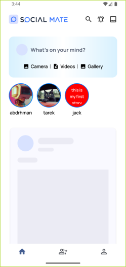 | Home feed variations           |
| 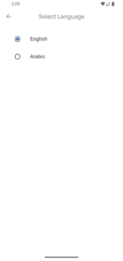                                                                                                                                                                                | Language selection             |
| 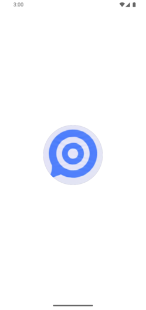                                                                                                                                                                               | Splash screen                  |
| 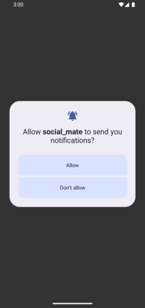                                                                                                                                                           | Notification permission prompt |
| 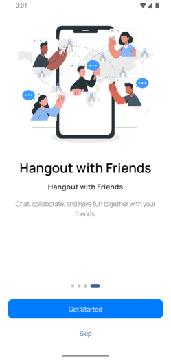 … 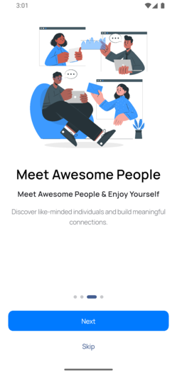                                                                                                     | Onboarding pages               |
| 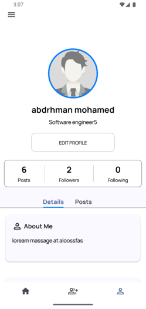 / 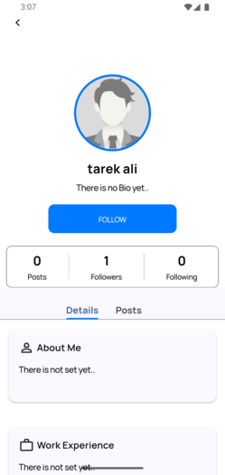                                                                                                 | Profile views                  |
| 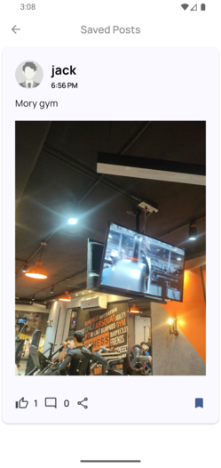                                                                                                                                                                                    | Saved posts                    |
| 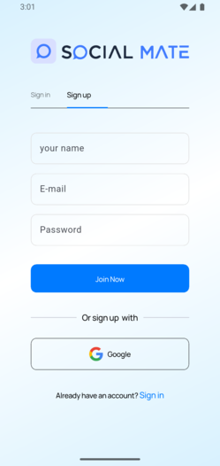 / 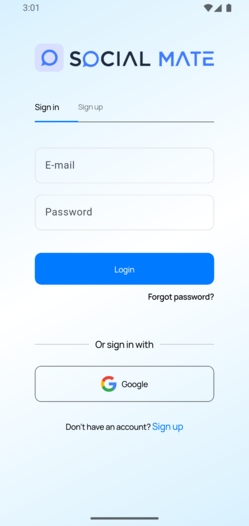                                                                                                                               | Authentication screens         |
| 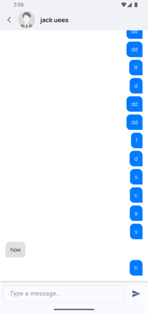                                                                                                                                                                                    | One‑to‑one chat                |
| 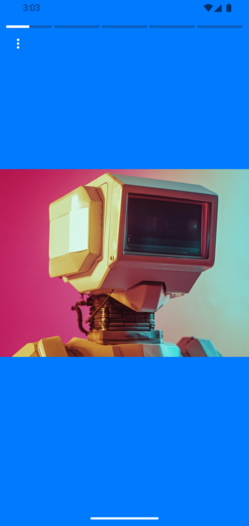 / 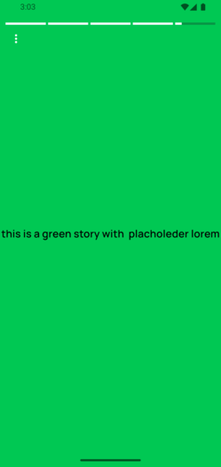                                                                                                                               | Story interface                |
| 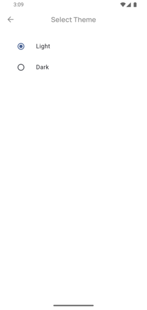                                                                                                                                                                                  | Theme selection                |
| 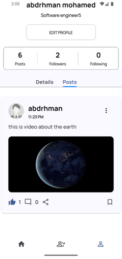                                                                                                                                                                                        | User post view                 |
|                                                                                                                                                                             | Discover search page           |
| 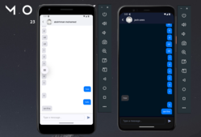                                                                                                                                                                            | Real‑time chat example         |

### 🌙 Dark Mode

| Screenshot                                                                                                                                                                           | Page            |
| ------------------------------------------------------------------------------------------------------------------------------------------------------------------------------------ | --------------- |
| 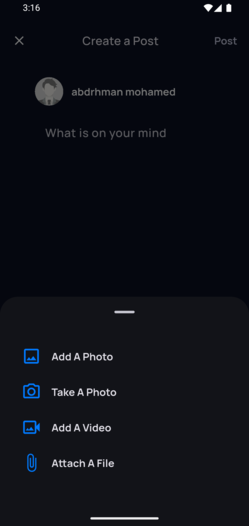 / 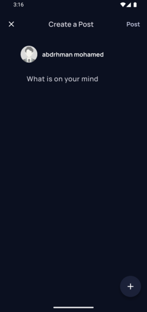                                                      | Add post        |
| 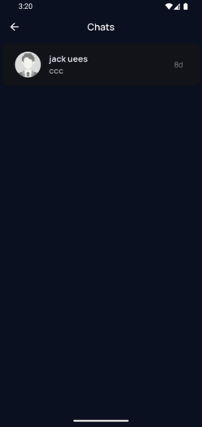 / 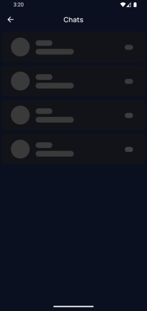                                                          | Chats list      |
| 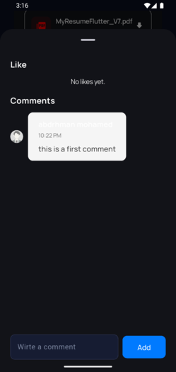                                                                                                                           | Comments        |
| 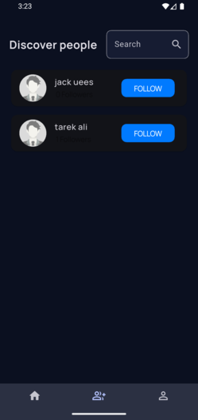                                                                                                                           | Discover feed   |
| 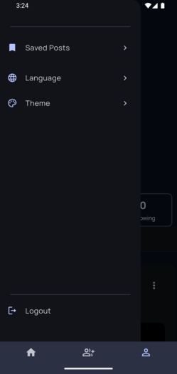                                                                                                                               | Drawer          |
| 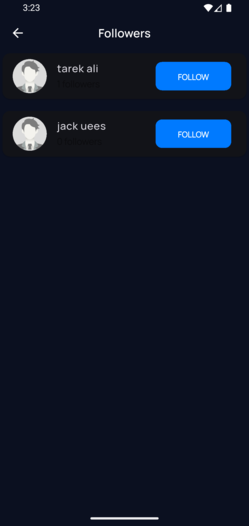                                                                                                                         | Followers       |
| 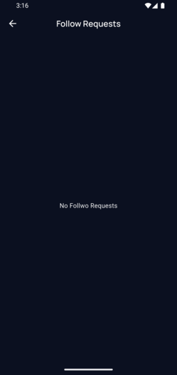                                                                                                             | Follow requests |
| 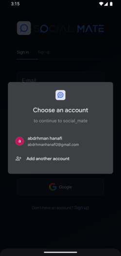                                                                                                                  | Google sign‑in  |
| 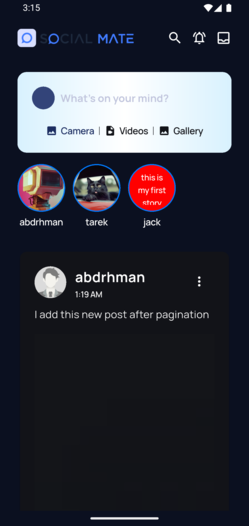 / 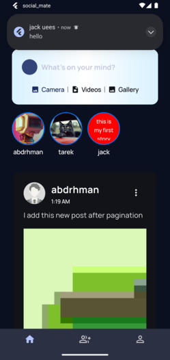 / 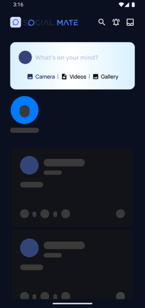 | Home            |
|                                                                                                                  | Splash          |
|                                                                                                              | Private profile |
|                                                                                                                      | Public chat     |
|                                                                                                                      | Saved posts     |
|  /                                                                   | Auth screens    |
|                                                                                                                      | Chat            |
|                                                                                                                                  | Story           |
|                                                                                                                        | User post       |
|  /                                      | Misc. assets    |

> 📁 _Images are grouped by folder; refer to filenames when adding new screenshots to maintain consistency._

---

## 📂 Project Structure

```
lib/
 ├── core/                 # shared utilities, services, cubits, theme
 │   ├── cubits/           # Bloc/Cubit state managers
 │   ├── models/
 │   ├── pages/            # Common pages (onboarding, etc.)
 │   ├── services/         # API, Supabase, native helpers
 │   ├── utils/            # constants, routes, theme helpers
 │   └── views/            # shared widgets
 ├── features/             # feature modules
 │   ├── auth/             # authentication flows
 │   ├── chat/             # messaging
 │   ├── discover/         # discovery feed
 │   ├── followRequest/
 │   ├── home/             # home feed
 │   ├── profile/          # user profiles, settings, theme/lang
 │   └── story/            # stories functionality
 ├── generated/            # localization/generated code
 ├── l10n/                 # ARB files for translations
 ├── firebase_options.dart
 ├── main.dart             # app entry point, BlocProviders
 └── root.dart             # root widget with router
```

Each `features/*` directory typically contains its own `cubit`, `data`, `models`, `services`, and `views` subfolders, following a Clean‑Architecture style breakdown.

---

## 🚀 Getting Started

### Prerequisites

- Install [Flutter](https://flutter.dev/docs/get-started/install) (SDK ≥ 3.9.2).
- A suitable IDE (VS Code, Android Studio) with Flutter & Dart plugins.
- Optional: Android/iOS emulator or physical device.
- Configure `.env` file with Supabase keys (refer to `pubspec.yaml` assets).

### Installation

```bash
git clone <repository-url>
cd social_mate
flutter pub get
flutter run
```

### 🎯 How to Use

1. **Entry point**: `lib/main.dart` sets up `BlocProviders` (Auth, Theme, Onboarding, Localization, Internet) and launches `Root` router.
2. **Switch languages**: use the language selector in the profile/settings page; `LocalizationCubit` updates `Locale`.
3. **Toggle themes**: open theme selection (profile > settings) to pick Light/Dark/System; `ThemeCubit` persists choice.
4. **User flows**:
   - New user: browse onboarding → sign up / login → explore feed.
   - Create posts/stories or follow other users.
   - Tap chat icon to start conversations; messages stored via Supabase.
   - Accept follow requests from the “Follow Requests” tab.
   - Edit profile, view saved posts, manage privacy.
   - Receive push notifications for chat/messages via Supabase function in `supabase/functions/push`.

### 🧪 Testing

- Only default `test/widget_test.dart` present.
- Recommend adding unit tests for cubits and widget tests for key flows.

---

## 🤝 Contributing

1. Fork the repo.
2. Create a feature branch: `git checkout -b feature/foo`.
3. Commit changes: `git commit -m "Add foo"`.
4. Push and open a pull request.
5. Ensure code follows lint rules (`flutter analyze`) and update/add tests.

Please keep architecture boundaries (core vs feature) intact and update `pubspec.yaml` for new dependencies.

---

## 📄 License

No license file detected.  
Consider adding an [MIT](https://choosealicense.com/licenses/mit/) or other open‑source license to clarify usage and contributions.

---

> **Tip:** This README is automatically generated from the current source tree.  
> Add new assets, features, or dependencies and re‑run the generator to keep it up‑to‑date.
